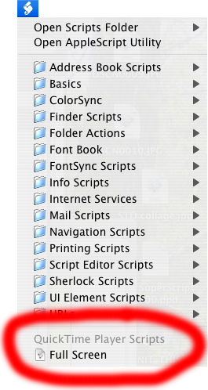

It's fairly easy to make QuickTime Player go full screen, even if you don't want to pay for "QuickTime Pro".  You can do it with a small AppleScript and the Script Menu.  (This was inspired by [QuikTimeFS](http://macweaver.com/software/quiktimefs/), but that requires running an extra little application every time you want to go full screen.)

Instead of walking you through the process of enabling the Script Menu, creating the necessary folders, and using the Script Editor to create the one-line AppleScript, I've written an AppleScript that does all of those steps for you: [Setup Full Screen](Setup%20Full%20Screen.app.zip).

After you download and run that, you'll have the Script Menu toward the right end of your menu bar.  It looks like this:  .

If you launch QuickTime Player, you'll find a Full Screen script in the script menu:

When you select that menu item, if you have a movie open, the movie will play full screen.  You can press the Escape key (labelled "esc" at the upper left corner of your keyboard) to get back out of full screen mode.

If you don't trust me, you can inspect the Setup Full Screen script by opening it with Applications &gt; AppleScript &gt; Script Editor.

Update:  It turns out I'm not the only one to think of this.  <a href='http://www.macparc.ch/mirror/QT_Full_Screen/'>QT Full Screen</a> does roughly the same thing, but uses an Installer package to install the full-screen script instead of doing it in an AppleScript.
