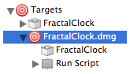
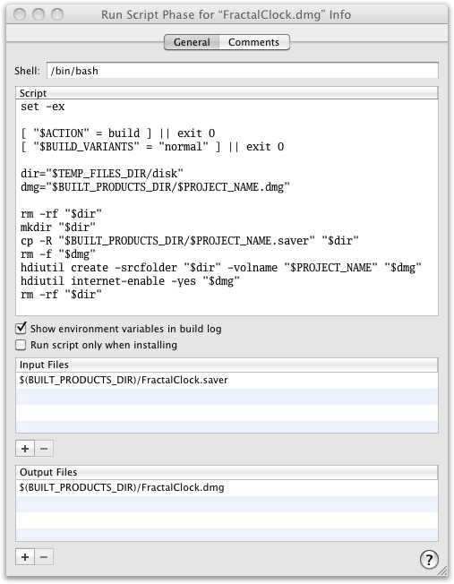

So I wrote a MacOS X screen saver, <a href='http://dqd.com/~mayoff/programs/FractalClock'>Fractal Clock</a>.  The next thing to do is make it available to the general public.  Apple <a href='http://developer.apple.com/legacy/mac/library/#documentation/DeveloperTools/Conceptual/SoftwareDistribution4/Containers/Containers.html'>recommends</a> distributing software using disk images.

I could build the disk image using Disk Utility, but if I need to do so often, using Disk Utility will be tedious.  And if I need to do so rarely, I'll forget the steps.  Obviously I should automate the process.

Since I'm using Xcode to build FractalClock.saver, I'm going to put the automation right in my FractalClock Xcode project.

So, first I choose menu item Project &gt; New Target.  From the list that pops up, I choose &ldquo;Shell Script Target&rdquo;.  I name it &ldquo;FractalClock.dmg&rdquo; because that's what I intend to build.  Xcode immediately displays the info pane for the new target.  Since I'll need to have FractalClock.saver built before I can build a disk image containing it, I need to add a direct dependency.  I click the plus button at the bottom of the info pane and choose FractalClock from the list.  Then I close the pane. I click on the disclosure triangle next to the new target in the Groups &amp; Files list, so it looks like this:

I double-click on "Run Script" and get the info pane for that phase.  Here's the script: *test* \*test\*

<pre>set -ex

[ "&#36;ACTION" = build ] || exit 0
[ "&#36;BUILD_VARIANTS" = "normal" ] || exit 0

dir="&#36;TEMP_FILES_DIR/disk"
dmg="&#36;BUILT_PRODUCTS_DIR/&#36;PROJECT_NAME.dmg"

rm -rf "&#36;dir"
mkdir "&#36;dir"
cp -R "&#36;BUILT_PRODUCTS_DIR/&#36;PROJECT_NAME.saver" "&#36;dir"
rm -f "&#36;dmg"
hdiutil create -srcfolder "&#36;dir" -volname "&#36;PROJECT_NAME" "&#36;dmg"
hdiutil internet-enable -yes "&#36;dmg"
rm -rf "&#36;dir"</pre>

I click the plus button under the Input Files list and set the name to <code>&#36;(BUILT<wbr>&#95;PRODUCTS<wbr>&#95;DIR)/<wbr>FractalClock<wbr>.saver</code>.  Then I click the plus button under the Output Files list and set the name to <code>&#36;(BUILT<wbr>&#95;PRODUCTS<wbr>&#95;DIR)<wbr>/FractalClock<wbr>.dmg</code>.  The pane ends up looking like this:

Now I can build a disk image containing FractalClock.saver by right-clicking on the FractalClock.dmg target and choosing "Build FractalClock.dmg".  The resulting disk image (found in the <code>build/Release</code> subdirectory) is Internet-enabled, so if I put it on the web and a visitor downloads it with Safari, Safari will automatically unpack FractalClock.saver and put the disk image in the Trash.

I also want to build a disk image containing the FractalClock source code.  So I create another target, named FractalClock-source.dmg.  It doesn't have any direct dependencies.  I could make all of the source files be its direct dependencies, but that's too much work.  At any rate, I want the contents of the disk image to be a pristine copy of the source code, without any of the build files.  Since I'm keeping the source code in Subversion, I'll make the shell script for FractalClock-source.dmg check out a fresh copy of the source tree.  Here's the script:

<pre>set -ex

[ "&#36;ACTION" = build ] || exit 0
[ "&#36;BUILD_VARIANTS" = "normal" ] || exit 0

url="&#36;(svn info . | grep ^URL | sed 's/^URL: //')"
dir="&#36;TEMP_FILES_DIR/disk"
dmg="&#36;BUILT_PRODUCTS_DIR/&#36;PROJECT_NAME-source.dmg"

rm -rf "&#36;dir"
mkdir "&#36;dir"
svn export "&#36;url" "&#36;dir/FractalClock-source"
rm -f "&#36;dmg"
hdiutil create -srcfolder "&#36;dir" -volname "&#36;PROJECT_NAME-source" "&#36;dmg"
hdiutil internet-enable -yes "&#36;dmg"
rm -rf "&#36;dir"</pre>

I don't add any files to the Input Files or Output Files lists for the FractalClock-source.dmg Run Script phase.  It's too much work to list all of the individual files that are its input, and if I list its output but not its input then Xcode won't know when it needs to be rebuilt.  This way, it will just rebuild it from scratch whenever I right-click the target and choose Build.

Since I'm going to be putting the disk images on my web site, I want to be able to upload them easily also.  So I create a subdirectory named <code>web</code> in my project directory.  I put the web files other than the disk images there.  There are just two, <code>index.html</code> and <code>saver.png</code>.  Then I create one more shell script target, named "Web Site".  It has two direct dependencies: FractalClock.dmg and FractalClock-source.dmg.  Here's the script:

<pre>set -ex

rsync -avz "&#36;BUILT_PRODUCTS_DIR/&#36;PROJECT_NAME.dmg" "www.dqd.com:www/programs/FractalClock/."
rsync -avz "&#36;BUILT_PRODUCTS_DIR/&#36;PROJECT_NAME-source.dmg" "www.dqd.com:www/programs/FractalClock/."
rsync -avz "web/." "www.dqd.com:www/programs/FractalClock/."</pre>

Now, when I right-click on the "Web Site" target and choosing "Build Web Site", Xcode builds both the application and source disk images, and copies them and the web files to my web site.  What could be simpler?
