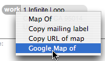

The Mac OS X Address Book (as of Tiger at least) makes it easy to send an address to MapQuest.  I've packaged a little AppleScript that sends it to Google Maps:
 

Click the picture to download the script.  Put the script in your `Macintosh HD:Library:Address Book Plug-Ins` folder or the `Library:Address Book Plug-Ins` folder in your home folder.  Then restart Address Book.

