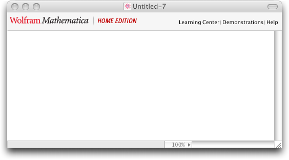

<a href="http://www.wolfram.com/products/mathematicahomeedition/">Mathematica Home Edition</a> includes a banner ad for itself at the top of every new notebook you create:

How annoying.  You can remove it by evaluating this expression:

    SetOptions[SelectedNotebook[],DockedCells->{}]

I haven't figured out how to make this happen automatically in every new notebook I create.

