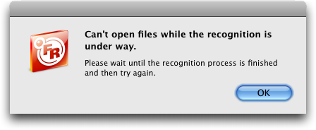

The <a href="http://www.fujitsu.com/us/services/computing/peripherals/scanners/scansnap/s510m.html">Fujitsu ScanSnap S510M</a> is fantastic.  I got mine from <a href="http://www.amazon.com/ScanSnap-S510M-Instant-Sheet-Fed-Scanner/dp/B000WJCX18">amazon.com</a> for $450.88 total.

It's a sheet-fed scanner.  This means I can only scan loose pages - if I want to scan a magazine or book page, I have to cut or rip it out first.  But since the scanner is not a flatbed with a big pane of glass, it's small enough to keep on a corner of my desk, within arm's reach.

It's <em>fast</em>.  It scans both sides of a sheet of paper simultaneously, in color, in about three seconds.  If I have a several-page document, the automatic document feeder (ADF) feeds it pages as fast as it can scan them.  It automatically detects blank pages and doesn't save them on my computer.

The software runs unobtrusively in the background all the time, so scanning a document is a trivial amount of work.  I just put the document in the hopper and press the "Scan" button on the scanner.  A few seconds later, I have a PDF on my computer.

Fujitsu says the S510M provides one-touch scanning to searchable PDFs.  Indeed, out of the box, the ScanSnap software will automatically run OCR (optical character recognition) on each scanned document.  The OCR program is an OEM version of Abbyy FineReader and is great at recognizing text.  However, it's slow.  And worse, when it's busy OCRing a document, I can't queue up another document for it to process.

Here's what happens.  I scan document A.  The ScanSnap software creates a PDF of document A and sends it to FineReader, which starts OCRing it.  While FineReader is busy, I scan document B.  The ScanSnap software creates a PDF of document B and sends it to FineReader, which is still busy doing OCR on document A.  FineReader presents an error message:

When I click OK, FineReader continues processing document A.  It doesn't remember that it was asked to process document B.  I have to wait until it's done with document A before I ask it to process document B.

And like I said, the S510M is fast.  It's very easy to scan two one-page documents in a row faster than FineReader can keep up.

That said, the S510M is still terrific.  I work around the slowness of FineReader by scanning a bunch of documents without OCRing, then dragging them all to FineReader at once.  I've eliminated four or five boxes of documents that I never got around to filing.  A lot of it I ended up throwing away (recycling) without scanning, but in the end I have 2349 scanned pages so far (according to <a href="http://www.ironicsoftware.com/yep/index.html">Yep!</a>).

To eliminate the pantloads of magazines that Delia has built up, I got her agreement on buying a <a href="http://www.comemachines.com/html/cometm-2700.html">paper stack cutter</a> from eBay for $200.  She will go through the magazines and pick out the articles she wants to keep.  We'll cut the spines off and scan in those articles, then recycle the magazines.  This plan came from <a href="http://www.43folders.com/2007/11/06/palimpsest-guide-mostly-paperless-life">43folders</a>.  I don't know how much it will be executed.
