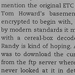
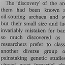
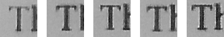
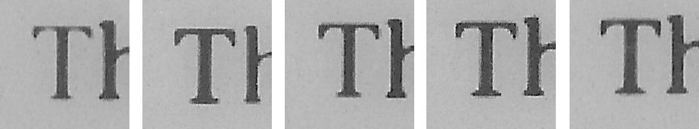

I have a Kindle 2.  The built-in font used for book text is apparently <a href="http://www.linotype.com/1313/pmncaecilia-family.html">Caecilia</a>.  I scanned my Kindle displaying a page of <a href='http://books.google.com/books?id=FUha9wJrSXMC'><i>Cryptonomicon</i></a> at the smallest font size.  Here's a picture that is actual size if you have a 96 dpi display.  Click on it for a 600 dpi image.

Now I'm reading <a href='http://books.google.com/books?id=gMOIt0qNcEMC'><i>Power, Sex, Suicide: Mitochondria and the Meaning of Life</i></a> on my Kindle.  Here's what it looks like.

Notice how the crossbar on the first character, a capital T, is barely visible?  The Kindle is displaying five capital Ts on that page.  Here they are.

Maybe some of the screen pixels don't work as well as others, and that's why the Ts are inconsistent.  Nope.  You can shift the location of that first T around the screen (using Go to Location... in the menu), and it always looks like that.  Here's what those Ts look like at the largest font size.

The answer seems to be that the Kindle is displaying those Ts differently on purpose.  While investigating this, I found out that Amazon invented a new ebook format called Topaz that allows embedded fonts.  <i>Cryptonomicon</i> uses the older format and the built-in font.  <i>Power, Sex, Suicide</i> uses the Topaz format and has an embedded font.  I don't know if the embedded font has several versions of each glyph, or if the software for displaying Topaz-embedded fonts is responsible.

Of course, it's not just Ts.  In this book, the Kindle seems to have two or more ways of displaying every glyph, so stroke weight varies at random all over the page, and lots of strokes almost entirely disappear.  It really makes the book much less pleasant to read.
